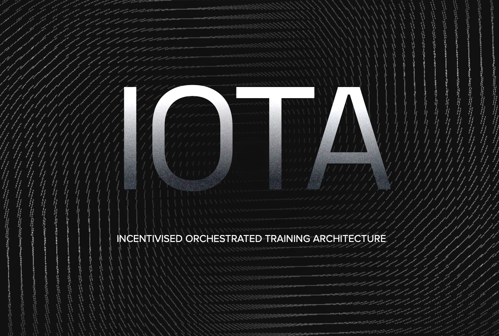
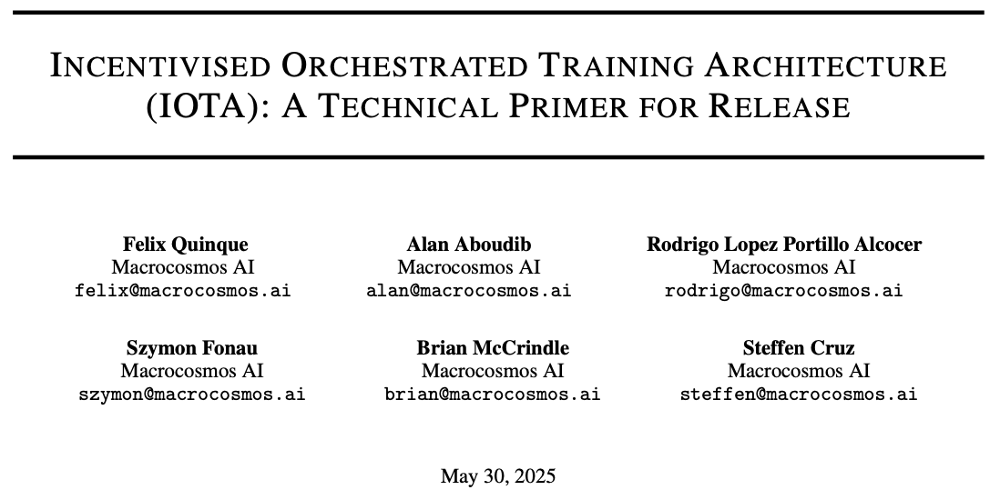

# IOTA

**I**ncentivized **O**rchestrated **T**raining **A**rchitecture (IOTA) is a framework for pretraining large language models across a network of heterogeneous, unreliable, permissionless and token incentivized machines. IOTA employs a data- and pipeline-parallel architecture to accelerate training and reduce hardware requirements for participants.

*explore above*

## **Overview**:
- Orchestrator distributes model layers across heterogeneous miners and streams activations between them.
- All network communication is mediated via the orchestrator, and a shared S3 bucket is used to store activations and layer weights.
- Miners compete to process as many activations as possible in the training stage.
- Miners periodically upload their local weights and merge their activations using a variant of Butterfly All-Reduce.
- Validators spot-check miners to ensure that work was performed as required.

For a more comprehensive overview, please refer to our technical paper [here](https://www.macrocosmos.ai/research/iota_primer.pdf). You can also find the report on [ArXiv](https://arxiv.org/abs/2507.17766)

    

## Current Run Information 📉
1. **1B parameter** Llama-inspired architecture with uninterrupted residual flow (see paper for details)
2. **5 layers**, breaking the model into 5 distinct training sections (1 head, 1 tail, 3 body)

## Future Run Information 📉
1. Scaling the system to 15B, 50B, and 100B models
2. More advanced compression techniques to speed up training

## Comprehensive Dashboard
Visualizing the state of the network, the number of miners the number of layers, and general metrics is paramount to understanding the training process. We provide a comprehensive dashboard [here](https://iota.macrocosmos.ai/dashboard/mainnet)

    

## Installation ⬇️
1. First install uv (https://docs.astral.sh/uv/)
2. Run `bash setup.sh` and choose Miner or Validator
3. Configure your `.env` file

## Addtional Miner Documentation 📚
Running the miner is as easy as `bash ./start_miner.sh`. For more information, reference [the official miner docs](https://docs.macrocosmos.ai/subnets/subnet-9-pre-training/subnet-9-iota-mining-setup-guide)

Use PM2 to run the miner in the background: `pm2 start pm2/miner.config.js`

## Additional Validation Documentation 📚
Running the validator `./start_validator.sh`. For more information, reference [the official validator docs](https://docs.macrocosmos.ai/subnets/subnet-9-pre-training/subnet-9-validating)

Use PM2 to run the validator in the background: `pm2 start pm2/validator.config.js`

## Compute Requirements 🧑🏻‍💻
The runs are currently in bfloat16, resulting in a total footprint of ~2GB for a 1B parameter model. As such, we recommend:
1. Cuda GPU with >= 8GB VRAM (RTX 4080, for example)
2. Ubuntu 22.04 (Jammy)
